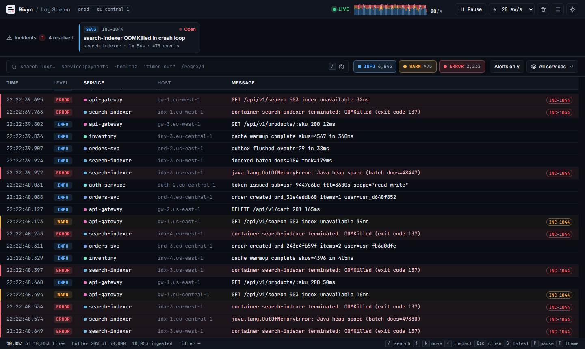
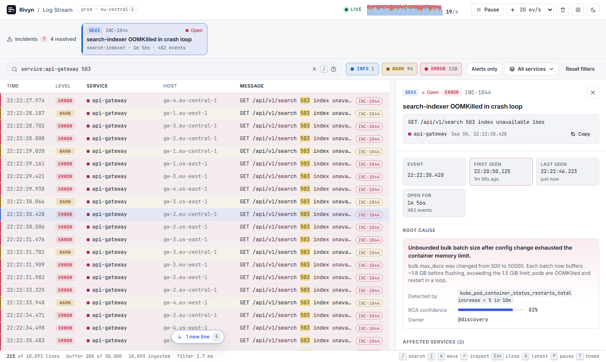
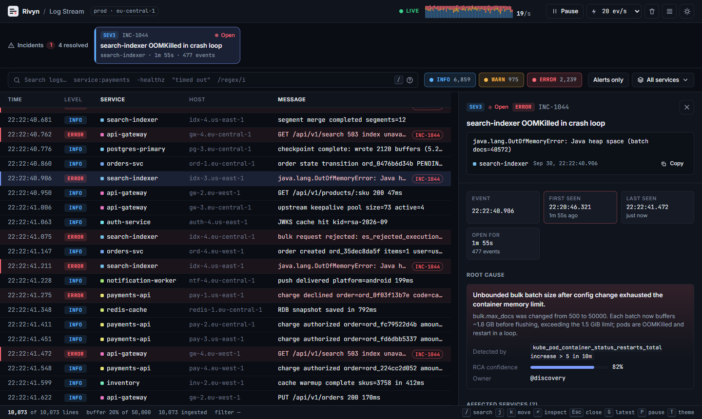
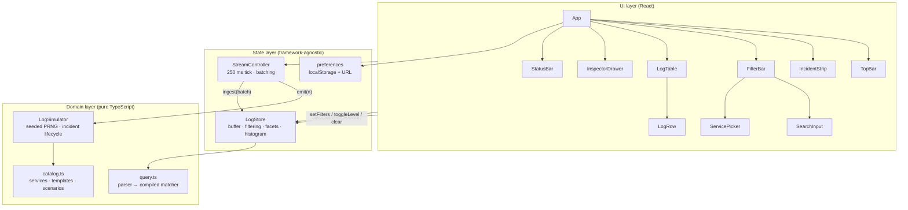
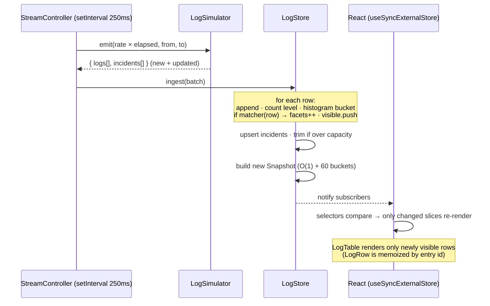
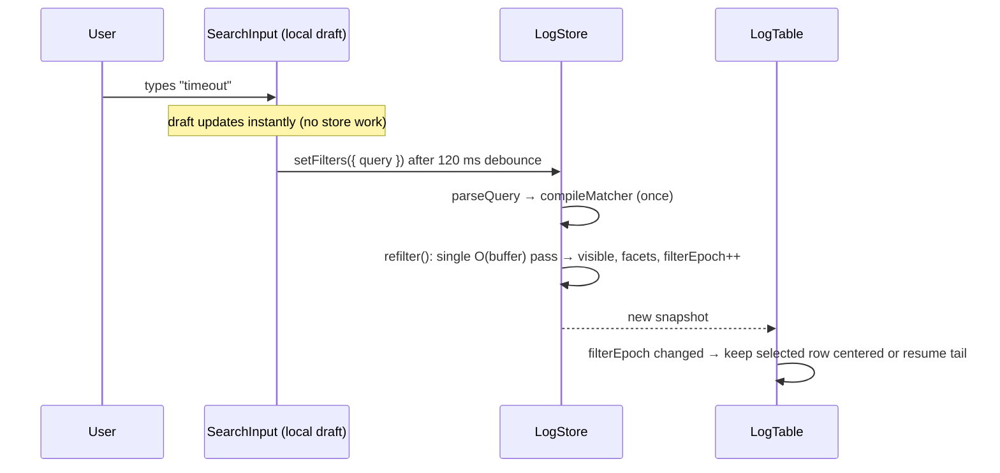
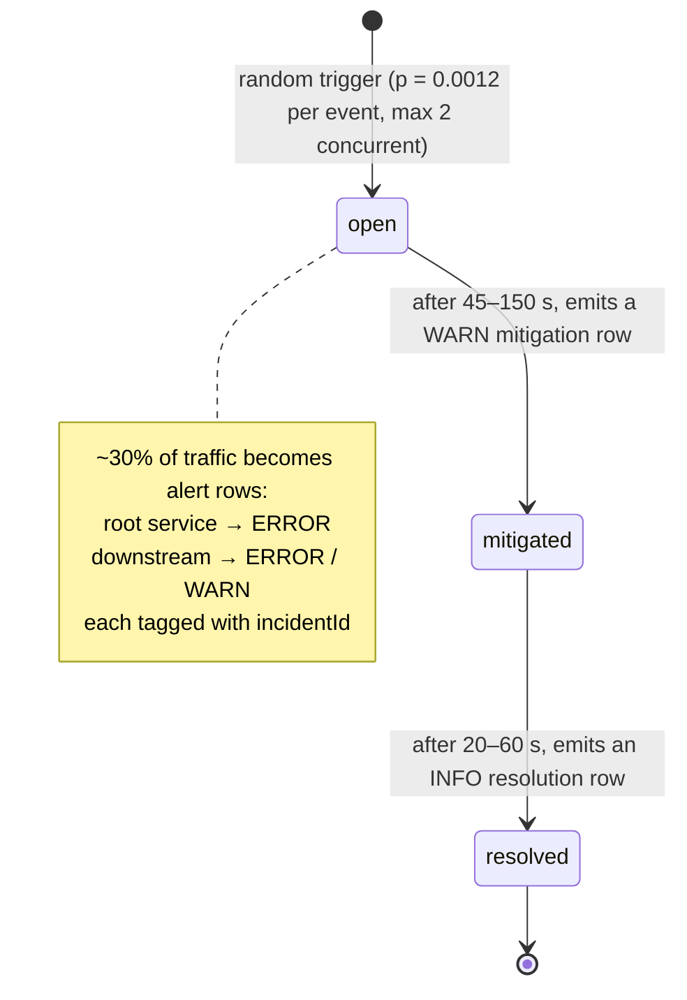
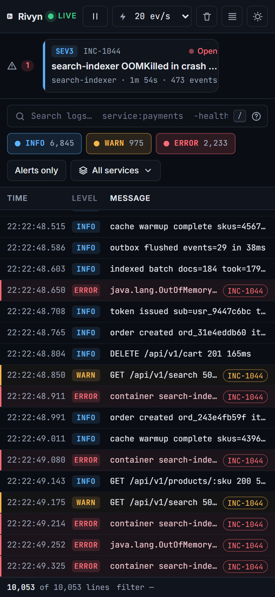
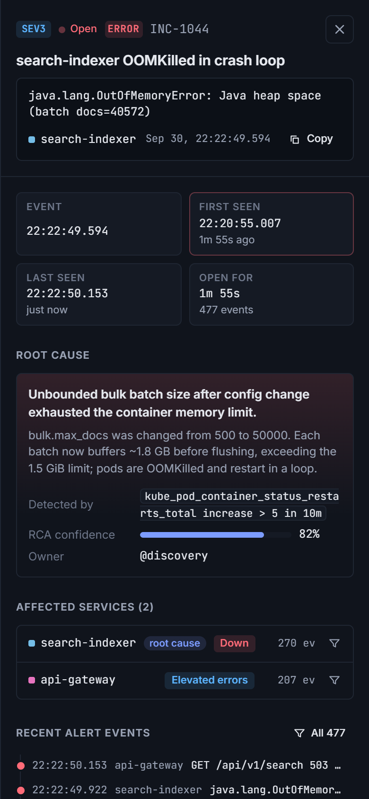

<div align="center">

# Real-Time Log Stream Viewer

**A keyboard-first incident & log tail for on-call engineers. Built for the Rivyn Frontend Developer Intern challenge.**


**[Live demo](#)** · **[Stress test (200k rows)](#)** · [Architecture](#architecture) · [Performance](#performance)

<!-- Replace the two (#) links above with your deployed URL, e.g. https://your-app.vercel.app and https://your-app.vercel.app/?rows=200000 -->



</div>

---

## Contents

1. [What it is](#what-it-is)
2. [Assignment checklist](#assignment-checklist)
3. [Quick start](#quick-start)
4. [Feature tour](#feature-tour)
5. [Architecture](#architecture)
6. [State management](#state-management)
7. [Virtualization](#virtualization)
8. [Filtering & the query engine](#filtering--the-query-engine)
9. [Mock data: the simulator](#mock-data-the-simulator)
10. [Performance](#performance)
11. [Design system & theming](#design-system--theming)
12. [Accessibility](#accessibility)
13. [Responsive behaviour](#responsive-behaviour)
14. [Project structure](#project-structure)
15. [Deployment](#deployment)
16. [Trade-offs & roadmap](#trade-offs--roadmap)
17. [AI-assisted workflow](#ai-assisted-workflow)

---

## What it is

A single-page developer tool that visualizes a live stream of log events and the incidents behind them:

- A **virtualized log table** that holds 10,000 lines on boot and grows to a 50,000-line sliding window, with live tailing at 5–500 events per second.
- **Instant filtering** by level, service and a small search language (field filters, exclusions, phrases, regex), with match highlighting.
- An **incident inspector** that joins any alert row to its incident: root cause, affected services, lifecycle timestamps, related events, stack trace and runbook.
- A **dark/light developer-tool look**: monospace log data, high contrast, dense but readable spacing.

Everything runs in the browser. A seeded simulator generates realistic traffic and incidents, so there's no backend to set up.

## Assignment checklist

| Requirement | Where it lives | Notes |
|---|---|---|
| Virtualized table with **5,000+** log lines | [`LogTable`](src/components/LogTable.tsx), [`useVirtualRows`](src/hooks/useVirtualRows.ts) | Boots with 10k lines. Try `?rows=200000`. About 40 DOM rows are mounted at any size. |
| Real-time **level filtering** (INFO / WARN / ERROR) | [`FilterBar`](src/components/FilterBar.tsx), [`LogStore.toggleLevel`](src/store/logStore.ts) | Live per-level counts. Alt/Shift+click shows only that level. |
| **Search without UI lag** | [`SearchInput`](src/components/SearchInput.tsx), [`query.ts`](src/domain/query.ts) | 120 ms debounce, pre-lowercased search text, compiled matcher, incremental filtering. |
| Click alert row → **inspection drawer** | [`InspectorDrawer`](src/components/InspectorDrawer.tsx) | Root cause, affected services, timestamp badges, event timeline, stack trace, actions. |
| **Dark / light theme**, monospace data, clean spacing | [`tokens.css`](src/styles/tokens.css), [`app.css`](src/styles/app.css) | Theme follows the system by default, is saved on toggle, and never flashes the wrong theme on load. |
| Live demo + repo | [Deployment](#deployment) | Vercel, Netlify and GitHub Pages configs are included. |
| README: architecture, state, performance | This document | |

## Quick start

Requires **Node ≥ 20.19** (tested on 22).

```bash
npm install
npm run dev          # http://localhost:5173
```

| Script | What it does |
|---|---|
| `npm run dev` | Vite dev server with HMR |
| `npm run build` | Type-check (`tsc -b`) and production build to `dist/` |
| `npm run preview` | Serve the production build locally |
| `npm run typecheck` | Type-check only |
| `npm run lint` | ESLint (typescript-eslint + react-hooks) |

### URL parameters

| Param | Example | Effect |
|---|---|---|
| `rows` | `?rows=200000` | Number of lines generated on boot (100–500,000). The buffer grows to fit. |
| `q` | `?q=service:payments%20timeout` | Initial search query |
| `levels` | `?levels=WARN,ERROR` | Initial level filter |
| `services` | `?services=api-gateway,auth-service` | Initial service filter |

Filters are written back to the URL as you change them, so any view can be shared as a link.

## Feature tour

### 1. Live log stream

- Newest lines appear at the bottom, like `tail -f`. The table follows them automatically.
- If you scroll up, select a row, or move with the keyboard, the table **stops moving** so you can read. A floating **"N new lines"** button counts what has arrived since. Click it (or press `G`) to jump back.
- **Pause / Resume** (`p`) stops the stream. The **rate** selector switches between 5, 20, 100 and 500 events per second.
- The top bar shows a **60-second volume chart** stacked by level and the current events per second.
- The **status bar** shows visible vs. buffered lines, buffer fill, total ingested, and how long the last full filter pass took.

### 2. Filtering & search



- **Level toggles** show live counts for the current search, so you always see how many ERRORs match before you turn them on.
- **Service picker**: multi-select popover. An empty selection means all services.
- **Alerts only**: shortcut for `is:alert`.
- **Search language** (the `?` button next to the search box explains it in the app):

| Query | Meaning |
|---|---|
| `timeout` | Case-insensitive substring across message, service, host, trace ID and incident ID |
| `"lock timeout"` | Exact phrase |
| `-healthz` | Exclude a term (also works with phrases: `-"cache hit"`) |
| `service:pay` · `svc:` | Service contains `pay` |
| `host:eu-west` | Host contains |
| `trace:3fa2` | Trace ID contains |
| `inc:INC-1044` | Rows belonging to an incident (exact) |
| `is:alert` | Only rows linked to an incident |
| `/5\d\d/i` | The whole query as a regular expression on the message |

Terms combine with AND, and field filters can be negated (`-service:redis`). An invalid regex shows an inline error instead of throwing.

### 3. Incident inspector



Open it by clicking an alert row (red/amber rows tagged `INC-xxxx`), clicking an incident card, or pressing `Enter` on a selected row. It contains:

- **Header:** severity (`SEV1–3`), live status (open → mitigated → resolved), level, and incident ID. The full message is shown untruncated with a copy button.
- **Timestamp badges:** Event, First seen, Last seen, Mitigated, Resolved, and Open for / Duration. Relative times ("1m 56s ago") update every second, and hovering shows the ISO time.
- **Root cause:** summary, explanation, the detection signal (e.g. `pg_stat_activity.active > 195 for 2m`), RCA confidence bar, and owning team.
- **Affected services:** root service marked, impact (Down / Degraded / Elevated errors), events per service, and a one-click filter for each.
- **Recent alert events:** a clickable timeline that updates live as new alerts arrive.
- **Stack trace**, **suggested actions**, and a **runbook** link.
- **Attributes** (service, host, trace, pod, version, HTTP status, duration) with one-click filters, plus the **raw event JSON** with copy.

Rows that aren't linked to an incident open the same drawer with the event details, and WARN/ERROR rows get a note that they aren't correlated with an incident.

On desktop the drawer is **non-modal**: it sits beside the table, so `j` / `k` keeps moving through rows while the drawer follows the selection. On small screens it becomes a full-screen sheet.

### 4. Keyboard shortcuts

| Key | Action |
|---|---|
| `/` | Focus search |
| `j` / `k` · `↓` / `↑` | Next / previous row (updates the open drawer) |
| `PgDn` / `PgUp` · `Home` / `End` | Page / jump through the table (table focused) |
| `Enter` | Inspect the selected row |
| `Esc` | Close the drawer · clear or leave the search box |
| `G` / `g` | Jump to latest / first line |
| `p` | Pause / resume the stream |
| `t` | Toggle dark / light theme |

Shortcuts are ignored while you type in a field and when Ctrl/Cmd/Alt is held, so browser shortcuts keep working.

## Architecture

The app is split into three layers. Dependencies only point downward:



| Layer | Knows about | Responsibility |
|---|---|---|
| **Domain** (`src/domain`) | nothing else | Types, mock data generation, query parsing and matching, formatting. Pure functions and classes, easy to unit-test. |
| **State** (`src/store`) | Domain | Holds the log buffer and incidents, applies filters incrementally, produces immutable snapshots, drives the stream. **No React imports**, except in the thin `StoreContext.tsx` adapter. |
| **UI** (`src/components`, `src/hooks`, `App.tsx`) | State, Domain | Rendering, interaction, virtualization, keyboard handling. Never mutates data directly. |

### Data flow: one stream tick



### Data flow: user changes a filter



### Component tree

```
<StoreProvider value={{ store, stream }}>
└─ <App>                         selection · drawer · prefs · global hotkeys · URL sync
   ├─ <TopBar>                   brand · live indicator · <VolumeChart> · pause · rate · clear · density · theme
   ├─ <IncidentStrip>            open/mitigated incident cards → opens drawer
   ├─ <FilterBar>                <SearchInput> · level toggles · Alerts only · <ServicePicker> · reset
   ├─ <main.workspace>           CSS grid: table | drawer
   │  ├─ <LogTable>              ARIA grid · virtual window · live-tail logic · keyboard nav
   │  │  └─ <LogRow> × ~40       memoized · translateY positioned · <Highlight>
   │  └─ <InspectorDrawer>       <IncidentDetails> · <EventDetails> · time badges · copy buttons
   └─ <StatusBar>                counts · buffer fill · filter timing · shortcut hints
```

### Data model

```ts
interface LogEntry {
  id: number;            // monotonic, contiguous → O(1) lookup, stable React key
  ts: number;            // epoch ms, monotonic with id
  level: 'INFO' | 'WARN' | 'ERROR';
  service: string;
  host: string;
  traceId: string;
  message: string;
  incidentId?: string;   // present on alert rows → joins row to Incident
  meta: Record<string, string | number | boolean>;  // pod, version, http_status, duration_ms…
  haystack: string;      // lower-cased search text, computed once at ingest
}

interface Incident {
  id: string;                       // INC-1041…
  title: string;
  severity: 'SEV1' | 'SEV2' | 'SEV3';
  status: 'open' | 'mitigated' | 'resolved';
  rootService: string;
  affected: { name; impact: 'down' | 'degraded' | 'elevated-errors'; events; isRoot }[];
  rootCause: { summary; detail; signal; confidence };
  firstSeen; lastSeen; mitigatedAt?; resolvedAt?;
  eventCount: number;
  stackTrace?; actions: string[]; runbook: string; owner: string;
}
```

`id` and `ts` both increase monotonically across the stream. The store relies on this for binary search in the visible list and for O(1) `getEntry(id)` (`entries[id - entries[0].id]`).

## State management

**No Redux, Zustand or React Query.** The problem is a high-frequency, append-mostly data stream, and a small purpose-built external store handles that better than a generic state library.

### 1. Stream state: `LogStore` + `useSyncExternalStore`

`LogStore` ([`src/store/logStore.ts`](src/store/logStore.ts)) is a plain TypeScript class that owns:

| Field | Purpose |
|---|---|
| `entries` | Sliding-window buffer of all rows (capacity 50k by default) |
| `visible` | Rows passing the current filter, in order |
| `facets` / `totals` | Per-level counts for the current search / for the whole buffer |
| `incidents` | `Map<id, Incident>` plus a sorted list (open → mitigated → resolved, then severity, then recency) |
| `incidentLogs` | Last 200 alert rows per incident, for the drawer timeline |
| `buckets` | Per-second level counts for the 60 s volume chart |
| `filters`, `parsed`, `matcher` | Current filter, its parsed form, and the compiled predicate |

Every mutation (`ingest`, `setFilters`, `toggleLevel`, `setStream`, `clear`) ends with `commit()`. That builds a new immutable **`Snapshot`** object and notifies subscribers.

React reads it through one hook:

```ts
// src/store/StoreContext.tsx
export function useSnapshot<T>(selector: (s: Snapshot) => T): T {
  const { store } = useStores();
  return useSyncExternalStore(store.subscribe, () => selector(store.getSnapshot()));
}

// usage: each component subscribes to exactly what it renders
const facets    = useSnapshot((s) => s.facets);
const incidents = useSnapshot((s) => s.incidents);   // same reference until an incident changes
```

Because selectors return snapshot fields (stable references) or primitives, **a component only re-renders when its slice changes**. For example, `IncidentStrip` skips re-rendering when you type a search, because the `incidents` array reference hasn't changed.

**Why an external store instead of `useState` / `useReducer`?**

- Ingest runs outside React on a timer. It doesn't need to be a React update until the batch is done.
- The store can be unit-tested, benchmarked, or moved into a Web Worker without touching components.
- `useSyncExternalStore` is safe under concurrent rendering: every render sees one consistent snapshot, never a half-applied one.

### 2. Tear-free append-only arrays

Copying a 50k-element array on every tick would be wasteful. Instead:

- `entries` and `visible` are **append-only between structural changes**. A structural change is a filter change, a trim or a clear, and those replace the array.
- Each snapshot records its own `visibleCount`. Consumers only read `visible[0 … visibleCount)`.

A render reading an older snapshot therefore never sees rows appended after it, with zero copying per tick. Structural changes bump `filterEpoch` (new list) or `visibleOffset` (rows trimmed from the front) so the table can react correctly.

### 3. UI state: React

| State | Where | Why |
|---|---|---|
| Selected entry, selected incident, drawer open | `App` `useState` | Pure UI concern. The selected `LogEntry` object is kept, so the drawer still works after the row rolls out of the buffer. |
| Theme, density, rate | `App` `useState` → `localStorage` | User preferences |
| Search draft | `SearchInput` local state | Instant typing feedback. The store sees it after a 120 ms debounce. |
| Live-tail / follow, "N new lines" anchor | `LogTable` local state | View concern tied to scroll position |
| Popovers (service picker, search help) | Local state | Ephemeral |

### 4. Persistence

- **`localStorage`**: theme (`rivyn.theme`), density and rate (`rivyn.prefs`). An inline script in `index.html` applies the theme **before first paint** to avoid a flash of the wrong theme.
- **URL**: `q`, `levels`, `services` via `history.replaceState`. Views are shareable and survive reloads, without adding history entries.

## Virtualization

Implemented from scratch in [`useVirtualRows`](src/hooks/useVirtualRows.ts) (~90 lines) rather than pulled in as a library, because live-tail anchoring and trim compensation needed tight control.

### Fixed-height windowing

Every row has the same height (30 px comfortable, 23 px compact), so mapping between a row index and its pixel offset is plain arithmetic:

```
first   = floor(scrollTop / rowHeight)
rows    = ceil((viewportHeight - headerHeight) / rowHeight) + 1
start   = max(0, first - overscan)            // overscan = 12
end     = min(count, first + rows + overscan)
height  = count × rowHeight                   // spacer div
row i   → transform: translateY(i × rowHeight)
```

- **No measurement, no layout thrash.** Nothing reads `getBoundingClientRect` per row.
- At most `rows + 2 × overscan` DOM rows (about 40–50) whether the buffer holds 1,000 or 500,000 lines.
- Rows are absolutely positioned with `transform`, and the scroller has `contain: strict`, so the browser limits layout and paint to the viewport.
- The header is `position: sticky` inside the scroller, and the hook subtracts its height from the usable viewport.

### Live tail without flicker

A naive virtual list shows blank rows for one frame when new rows are appended while tailing. The rendered window is based on the previous `scrollTop`, and the scroll event only arrives after paint.

Fix: in **tail mode the window is anchored to the end of the list** (`anchorBottom`), not to the last observed `scrollTop`. A `useLayoutEffect` then pins `scrollTop = scrollHeight` **before paint**. New rows appear in the same frame they arrive.

### Follow / pause rules

| Event | Result |
|---|---|
| User scrolls away from the bottom | Tail off, "N new lines" button appears |
| User scrolls back to the bottom | Tail on |
| Click a row / keyboard move | Tail off, so the selected row stays put |
| "N new lines" button · `G` · `End` | Tail on, jump to bottom |
| Filter change | Keep the selected row centered if it survived, otherwise resume tail |

### Stable viewport while trimming

When the buffer overflows, the oldest 10% of rows are dropped. If you're reading history, that would shift everything up. The store exposes a cumulative `visibleOffset`. When it grows, `LogTable` subtracts `dropped × rowHeight` from `scrollTop` in a layout effect, so the rows you're reading stay exactly where they are.

### Accessible virtualization

The scroller is an ARIA `grid` with `aria-rowcount` equal to the total, not just the mounted rows. Each row has `aria-rowindex`, and the selection is exposed through **`aria-activedescendant`**. It points only at mounted rows, and focus stays on the grid, so keyboard focus never gets lost when rows unmount.

## Filtering & the query engine

### Parse once, match many

[`query.ts`](src/domain/query.ts) turns the raw search string into a `ParsedQuery` (terms, excluded terms, field clauses, `is:alert`, optional regex, highlight regex). `compileMatcher()` then turns that into a **single closure**, the hot path:

```ts
(e) => {
  if (alertsOnly && e.incidentId === undefined) return false;
  for (term of terms)    if (!e.haystack.includes(term)) return false;   // AND
  for (term of excluded) if ( e.haystack.includes(term)) return false;   // NOT
  for (f of fields)      /* service/host/trace contains, incident equals, negatable */
  return true;
}
```

- `haystack` is lower-cased **once at ingest**, so matching never allocates or lower-cases per keystroke.
- Plain `String.includes` beats a regex for literal terms. A regex is only used when you explicitly type `/…/`.
- Search matches are highlighted with one precompiled global regex (longest terms first). Zero-width matches are skipped and decoration stops after 64 matches per row, so a pathological pattern can't freeze rendering.

### Incremental filtering

| Situation | Work done |
|---|---|
| New batch arrives (every 250 ms) | Test **only the new rows**: O(batch), independent of buffer size |
| Filter changes | One full O(buffer) pass. It rebuilds `visible` and `facets` and records its duration (shown in the status bar). |
| Rows trimmed | Decrement counts for the dropped rows, slice `visible` at a binary-searched boundary |

Level toggles are applied after the search and service filters. That is why the level buttons can show counts for levels that are currently hidden.

## Mock data: the simulator

[`LogSimulator`](src/domain/simulator.ts) produces realistic, **deterministic** data: a seeded `mulberry32` PRNG, seed `20261006`. The same backfill appears on every reload, which makes debugging and screenshots reproducible.

### Platform model ([`catalog.ts`](src/domain/catalog.ts))

- **10 services** with traffic weights, owning teams, hosts across 3 regions, and INFO/WARN/ERROR message templates: `api-gateway`, `auth-service`, `payments-api`, `orders-svc`, `inventory`, `search-indexer`, `notification-worker`, `postgres-primary`, `redis-cache`, `kafka-broker`.
- **5 incident scenarios**, each with a root service, downstream affected services, root-cause write-up, detection signal, root and symptom log templates, a stack trace, remediation steps and a runbook:

| Scenario | Severity | Root → affected |
|---|---|---|
| Database connection pool exhausted | SEV1 | postgres-primary → orders-svc, payments-api, api-gateway |
| JWT validation failures after key rotation | SEV1 | auth-service → api-gateway, payments-api |
| Cache evictions causing auth latency spike | SEV2 | redis-cache → auth-service, api-gateway |
| Kafka partition leader election storm | SEV2 | kafka-broker → orders-svc, notification-worker |
| search-indexer OOMKilled in crash loop | SEV3 | search-indexer → api-gateway |

### Incident lifecycle



- Background traffic is about 90% INFO, 7.8% WARN and 2.2% ERROR. Isolated errors are **not** linked to an incident, which is realistic noise.
- The backfill **guarantees one open incident** at startup, kept open for 8–14 minutes, so reviewers always have something to inspect.
- Rows are emitted in timestamp order within each tick's time window, so `id` and `ts` stay monotonic.
- `StreamController` converts `rate × elapsed` into an event count, carrying fractional events between ticks. Catch-up bursts after a sleeping tab are capped at 5,000 events per tick.

## Performance

### Measured

Production build (`vite preview`), headless Chrome on a Windows laptop with no GPU. Headless numbers are conservative; a normal browser tab is usually smoother.

| Scenario | Result |
|---|---|
| Boot with 200,000 rows (`?rows=200000`) | ~2.3 s to network idle (includes generating all 200k rows) |
| Full re-filter: 10k rows | **1–3 ms** |
| Full re-filter: 180k rows, `service:payments timeout` | ~34 ms |
| Incremental filter per 250 ms tick | O(batch): ≤ 125 rows at 500 ev/s |
| Long tasks (> 50 ms) over 4 s at **500 events/s** with 180k rows | **None** |
| DOM rows mounted | ~34 (10k rows) · ~47 (200k rows) |
| Production bundle | JS **87 kB gzip** · CSS 8.7 kB gzip · fonts self-hosted (latin subset loaded on demand) |

### Techniques

| Problem | Approach |
|---|---|
| Rendering 50k–500k rows | Fixed-height windowing: arithmetic offsets, `transform` positioning, `contain: strict` |
| High event rates | **Batching**: one store commit per 250 ms tick means at most 4 renders/s regardless of rate |
| Re-rendering existing rows | `LogRow` is `memo`ized with stable props (`entry` object, `onSelect` callback, highlight regex), so a tick renders only newly visible rows |
| Re-rendering unrelated UI | Per-slice `useSnapshot` selectors |
| Filtering while streaming | Incremental O(batch) filtering. A full pass only when the filter itself changes. |
| Typing in search | Local draft plus 120 ms debounce, so a burst of keystrokes causes one scan, not one per key |
| Per-row string work | Pre-lowercased `haystack` at ingest, compiled matcher closure |
| Memory growth | Sliding window: drop the oldest 10% in one `slice` when over capacity (amortised O(1) per row) |
| Array copying per tick | Append-only arrays plus `visibleCount` in the snapshot (see [tear-free arrays](#2-tear-free-append-only-arrays)) |
| Lookup by id | Contiguous ids → `entries[id - firstId]`; binary search in `visible` |
| Chart cost | 60 per-second buckets updated at ingest. The SVG renders 180 rects, memoized. |
| Font loading | Self-hosted variable fonts via `@fontsource-variable`, split by unicode range |

## Design system & theming

- **Tokens** live in [`tokens.css`](src/styles/tokens.css) as CSS custom properties under `[data-theme='dark' | 'light']`: surfaces (`--bg`, `--bg-elev`, `--bg-inset`), borders, text tiers, an accent, and a semantic palette (`--info`, `--warn`, `--error`, `--ok`) each with a tint for badges and row backgrounds.
- **Theme switching** is a single `data-theme` attribute on `<html>`. No re-render cascade and no CSS-in-JS runtime.
- **Typography:** *Inter Variable* for UI, *JetBrains Mono Variable* for anything that is data (timestamps, levels, services, messages, IDs, JSON). Mono text uses tabular numbers, slashed zero, and **ligatures disabled** so `->` and `!=` render as typed.
- **Visual language:**
  - The level shows three ways, so you're never relying on colour alone: badge text, a faint row tint, and an inset left rail on alert rows.
  - Incident cards use a severity-coloured edge.
  - Each service gets a stable colour from a hash of its name.
- **Contrast:** light-theme warning/error colours are darkened (e.g. `--warn: #975a00`) to keep text readable on white.
- **Motion:** subtle entry animations for popovers and the drawer, a pulsing live dot, and all of it disabled under `prefers-reduced-motion`.

## Accessibility

- ARIA **grid** semantics for the table with `aria-rowcount`, `aria-rowindex`, column headers and `aria-activedescendant` selection. It is fully keyboard operable.
- Level toggles and "Alerts only" use `aria-pressed`. Popovers use `aria-expanded` / `aria-controls`. Search errors use `role="alert"` and `aria-invalid`.
- The drawer is a labelled `dialog`. It's non-modal on desktop, and on mobile focus moves into it. `Esc` closes it and focus returns to the table.
- Skip link to the log stream, visible `:focus-visible` rings everywhere, icon buttons with `aria-label`, and decorative SVGs marked `aria-hidden`.
- Live status (`Live` / `Paused`, empty states) is announced through `role="status"`.

> Full WCAG conformance can't be claimed from code alone. It needs manual testing with screen readers (NVDA, VoiceOver) and an expert review.

## Responsive behaviour

| Width | Layout |
|---|---|
| > 1280 px | All columns (time · level · service · host · message). Drawer docks at the right (`min(500px, 44vw)`). |
| ≤ 1280 px | Host column hidden, shortcut hints hidden |
| ≤ 1100 px + drawer open | Service column also hidden, so the message keeps room |
| ≤ 900 px | Drawer becomes an overlay sheet with backdrop. Environment chip and volume chart hidden. |
| ≤ 640 px | Compact top bar, full-width search, 3-column table (time · level · message), scrollable incident cards |

<p align="center">
  
  &nbsp;&nbsp;
  
</p>

## Project structure

```
.
├─ index.html                  app shell + pre-paint theme script
├─ vite.config.ts              base './' → works on any static host / sub-path
├─ eslint.config.js            typescript-eslint + react-hooks
├─ tsconfig*.json              strict, noUncheckedIndexedAccess, verbatimModuleSyntax
├─ vercel.json · netlify.toml  static hosting config
├─ .github/workflows/deploy.yml  CI: lint + build → GitHub Pages
├─ docs/screenshots/           images used in this README
└─ src/
   ├─ main.tsx                 composition root: store + simulator + stream, backfill, render
   ├─ App.tsx                  layout, selection, prefs, URL sync, global hotkeys
   ├─ domain/                  ── pure TypeScript, no React ──
   │  ├─ types.ts              LogEntry, Incident, Emission, levels
   │  ├─ catalog.ts            services, message templates, incident scenarios
   │  ├─ simulator.ts          LogSimulator: traffic + incident lifecycle
   │  ├─ query.ts              search parser + compiled matcher + highlight regex
   │  ├─ random.ts             mulberry32 PRNG helpers
   │  └─ format.ts             clock/duration/relative time, number format, service hue
   ├─ store/                   ── state, framework-agnostic ──
   │  ├─ logStore.ts           LogStore, Snapshot, incremental filtering, trimming
   │  ├─ streamController.ts   tick loop, rate, batching, pause/resume
   │  ├─ preferences.ts        localStorage prefs, URL filter (de)serialization
   │  └─ StoreContext.tsx      React adapter: provider + useSnapshot(selector)
   ├─ hooks/
   │  ├─ useVirtualRows.ts     fixed-height windowing, tail anchoring, scrollToIndex
   │  ├─ useHotkeys.ts         global single-key shortcuts (typing-aware)
   │  └─ useNow.ts             ticking clock for relative timestamps
   ├─ components/
   │  ├─ TopBar.tsx            brand, live state, volume chart, stream controls, theme
   │  ├─ VolumeChart.tsx       60 s stacked SVG sparkline
   │  ├─ IncidentStrip.tsx     active incident cards
   │  ├─ FilterBar.tsx         level toggles, alerts-only, service picker, reset
   │  ├─ SearchInput.tsx       debounced search + syntax help + error state
   │  ├─ ServicePicker.tsx     multi-select popover
   │  ├─ LogTable.tsx          virtual grid, live tail, keyboard nav, "N new lines"
   │  ├─ LogRow.tsx            memoized row
   │  ├─ Highlight.tsx         safe match highlighting
   │  ├─ InspectorDrawer.tsx   incident + event inspection panel
   │  ├─ StatusBar.tsx         counts, buffer, timing, shortcut hints
   │  ├─ Badges.tsx            level / severity / status / service badges
   │  └─ Icon.tsx              inline SVG icon set (no icon font)
   └─ styles/
      ├─ tokens.css            theme tokens (dark + light)
      └─ app.css               layout, components, responsive rules
```

**Tooling:** TypeScript 5.9 in strict mode with `noUncheckedIndexedAccess`, ESLint 10 with typescript-eslint and react-hooks rules, Vite 8. All dependency versions are pinned exactly.

## Deployment

The build is fully static (`dist/`) and uses relative asset paths (`base: './'`), so the same build works at a domain root or under a sub-path.

| Host | Steps |
|---|---|
| **Vercel** | Import the GitHub repo → Deploy. [`vercel.json`](vercel.json) sets the build command, output and immutable caching for `/assets`. |
| **Netlify** | "Add new site" → import repo. [`netlify.toml`](netlify.toml) sets the build, Node 22 and caching headers. |
| **GitHub Pages** | Repo *Settings → Pages → Source: GitHub Actions*, then push to `main`. [`deploy.yml`](.github/workflows/deploy.yml) runs lint + build and publishes. PRs run lint + build only. |

The app has no backend, no auth and makes no network requests. All data is generated in the browser.

## Trade-offs & roadmap

### Deliberate trade-offs

| Decision | Why | Cost |
|---|---|---|
| Fixed row height | O(1) offsets, no measuring, smooth at 500k rows | Long messages are truncated in the table (full text in the drawer, with the full value on hover for attributes) |
| Hand-written virtualizer and store | Tail anchoring, trim compensation and tear-free snapshots needed tight control; zero extra dependencies | More code to own than `@tanstack/react-virtual` + Zustand |
| Newest at the bottom (`tail -f`) | Matches terminal habits. Appends never shift the rows you're reading. | Oldest-first reading requires scrolling up |
| Simulator on the main thread | Simple, and fast enough (no long tasks at 500 ev/s) | A real high-volume parser would belong in a Worker |
| Non-modal drawer on desktop | You can keep browsing rows with `j` / `k` while inspecting | Two focus regions to manage |

### What I'd add for production

1. **Real transport:** swap `StreamController` for a WebSocket/SSE adapter with reconnect, backoff and server-side filters. The store API (`ingest(batch)`) stays the same.
2. **Worker offload:** move `LogStore` ingest and filtering into a Web Worker and transfer only the visible window for very high volumes.
3. **Tests:** Vitest unit tests for `query.ts`, `LogStore` (incremental vs. full filter equivalence, trimming) and the simulator lifecycle; Playwright for tailing, keyboard navigation and the drawer; axe-core accessibility checks in CI.
4. **Time range and history:** time-range picker, histogram brushing to zoom, "load older" from a backend.
5. **Expandable rows:** variable-height row expansion using measured heights with an offset cache.
6. **Incident actions:** acknowledge / assign / link to a PagerDuty or Opsgenie integration.
7. **Saved views and column settings:** named filter presets, resizable and reorderable columns.

## AI-assisted workflow

The challenge encourages AI-first engineering, so here is how it was used:

- **AI coding agent** (Kiro, running Claude) to scaffold the project, generate the mock-data catalog (services, message templates, incident scenarios), write most components and CSS, and draft this README.
- **Human direction and review** on the product and engineering decisions: the layered architecture, the external-store + selector model, incremental filtering, the live-tail and trim-compensation behaviour, the non-modal drawer, and the keyboard model.
- **Verification loop:** every iteration was type-checked, linted and built, then exercised in headless Chrome. The checks covered tail pinning, search and highlight, regex errors, level solo, drawer contents, keyboard navigation, theme switching, mobile layout, a 200k-row stress run and a 500 ev/s long-task check. The numbers in [Performance](#performance) come from those runs.

---

## 👤 Author

**Chandan Yadav**

📧 [yadavchandan6103@gmail.com](mailto:yadavchandan6103@gmail.com)
🔗 [GitHub](https://github.com/yadavchandan84) · [LinkedIn](https://www.linkedin.com/in/chandan-yadav-89aaa3253/)

<div align="center">

⭐ If you found this project useful, consider giving it a star.

</div>
